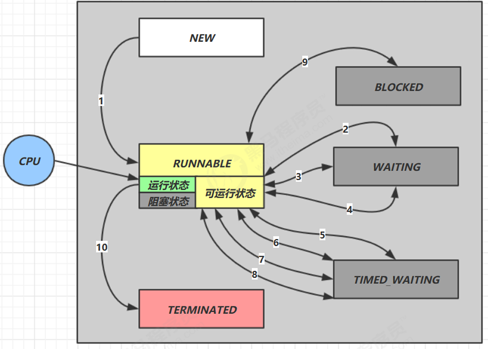

测试了三种扣款方式，分别是：
- 不安全
- 加锁
- cas

## 测试对比
测试类如下
```java
public class Main {
    public static void main(String[] args) {
        IAccountHandler accountUnsafeHandler = new AccountUnsafeHandler(10000);
        accountUnsafeHandler.withdraw(accountUnsafeHandler);

        IAccountHandler accountSyncHandler = new AccountSyncHandler(10000);
        accountUnsafeHandler.withdraw(accountSyncHandler);

        IAccountHandler accountCasHandler = new AccountCasHandler(10000);
        accountUnsafeHandler.withdraw(accountCasHandler);
    }
}
```
测试结果如下：
- 不安全最终的计算结果错误
- cas的效率高于加锁操作
```java
2510 cost: 300 ms
0 cost: 201 ms
0 cost: 160 ms
```

## CAS原理概述
其实 CAS 的底层是 lock cmpxchg 指令（X86 架构）：
- 在单核 CPU 和多核 CPU 下都能够保证【比较-交换】的原子性。 
- 在多核状态下，某个核执行到带 lock 的指令时，CPU 会让总线锁住，当这个核把此指令执行完毕，再开启总线。这个过程中不会被线程的调度机制所打断，保证了多个线程对内存操作的准确性，是原子的。

## CAS源码分析
以AtomicInteger为例，下面是它的部分源码

```java
public class AtomicInteger extends Number implements java.io.Serializable {
    private static final long serialVersionUID = 6214790243416807050L;

    /*
     * This class intended to be implemented using VarHandles, but there
     * are unresolved cyclic startup dependencies.
     */
    private static final Unsafe U = Unsafe.getUnsafe();
    private static final long VALUE
            = U.objectFieldOffset(AtomicInteger.class, "value");

    private volatile int value;

    /**
     * Creates a new AtomicInteger with the given initial value.
     *
     * @param initialValue the initial value
     */
    public AtomicInteger(int initialValue) {
        value = initialValue;
    }

    /**
     * Returns the current value,
     * with memory effects as specified by {@link VarHandle#getVolatile}.
     *
     * @return the current value
     */
    public final int get() {
        return value;
    }

    /**
     * Sets the value to {@code newValue},
     * with memory effects as specified by {@link VarHandle#setVolatile}.
     *
     * @param newValue the new value
     */
    public final void set(int newValue) {
        value = newValue;
    }

    /**
     * Sets the value to {@code newValue},
     * with memory effects as specified by {@link VarHandle#setRelease}.
     *
     * @param newValue the new value
     * @since 1.6
     */
    public final void lazySet(int newValue) {
        U.putIntRelease(this, VALUE, newValue);
    }

    /**
     * Atomically sets the value to {@code newValue} and returns the old value,
     * with memory effects as specified by {@link VarHandle#getAndSet}.
     *
     * @param newValue the new value
     * @return the previous value
     */
    public final int getAndSet(int newValue) {
        return U.getAndSetInt(this, VALUE, newValue);
    }

    /**
     * Atomically sets the value to {@code newValue}
     * if the current value {@code == expectedValue},
     * with memory effects as specified by {@link VarHandle#compareAndSet}.
     *
     * @param expectedValue the expected value
     * @param newValue the new value
     * @return {@code true} if successful. False return indicates that
     * the actual value was not equal to the expected value.
     */
    public final boolean compareAndSet(int expectedValue, int newValue) {
        return U.compareAndSetInt(this, VALUE, expectedValue, newValue);
    }
    ...
}
```

可以看到，无论是get还是set方法，其实都是在对内部的成员变量value操作，其实value就是原理的一部分
```java
private volatile int value;
```
value被volatile修饰，为什么？

> 获取共享变量时，为了保证该变量的可见性，需要使用 volatile 修饰。

volatile可以用来修饰成员变量和静态成员变量，他可以避免线程从自己的工作缓存中查找变量的值，必须到主存中获取它的值，线程操作 volatile 变量都是直接操作主存。

即一个线程对 volatile 变量的修改，对另一个线程可见。

## 注意事项

无锁情况下，即使cas重试失败，线程始终在高速运行，没有停歇，而 synchronized 会让线程在没有获得锁的时候，发生上下文切换，进入阻塞。

打个比喻：
- 线程就好像高速跑道上的赛车
- CPU 在这里就好比高速跑道

线程高速运行时，速度超快，一旦发生上下文切换synchronized，就好比赛车要减速、熄火， 等被唤醒又得重新打火、启动、加速... 恢复到高速运行，代价比较大

但是cas无锁情况下，因为线程要保持运行，需要额外 CPU 的支持，如果机器上或者服务器上没有额外的跑道，线程想高速运行也无从谈起，

**因为虽然cas不会进入阻塞，但由于CPU核数不足，没有分到时间片，线程仍然会进入可运行状态，还是会导致上下文切换。** 线程有六大状态
- 新建NEW
- 运行RUNNABLE
- 挂起TERMINATED
- 阻塞BLOCKED
- 等待WAITING
- 超时等待TIMED_WAITING

**但是运行态又分为：运行 和 可运行**，可运行状态依然会导致线程的上下文切换



因此cas最适合的场景是用户线程数 **小于**  机器的CPU核数，才能发挥最大效果

