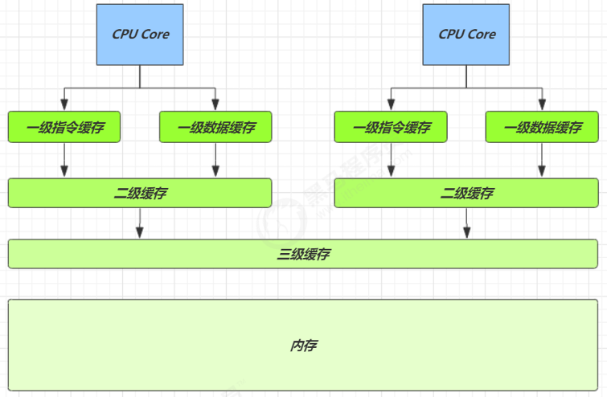

下述代码在并发量比较低的情况下，线程冲突的概率比较小，自旋的次数不会很多
```Java
AtomicLong count = new AtomicLong(); 
count.addAndGet(1); 
```
但是，高并发情况下，N个线程同时进行自旋操作导致CPU核数N打满场景，此时超过CPU核数的线程由于没有CPU资源，依旧会发生线程上下文的切换。此时CAS自旋也会造成性能瓶颈

就是LongAdder引入的初衷，解决高并发环境下AtomictLong的自旋瓶颈问题。

## cells数组，分散热点技术
从LongAddr的成员变量开始分析
```java
    /** Number of CPUS, to place bound on table size */
    static final int NCPU = Runtime.getRuntime().availableProcessors();

    /**
     * Table of cells. When non-null, size is a power of 2.
     */
    transient volatile Cell[] cells;

    /**
     * Base value, used mainly when there is no contention, but also as
     * a fallback during table initialization races. Updated via CAS.
     */
    transient volatile long base;

    /**
     * Spinlock (locked via CAS) used when resizing and/or creating Cells.
     */
    transient volatile int cellsBusy;
```
cells数组是一种分散热点数据的技术，大概流程如下


## cells数组，防止缓存行伪共享
Cell定义如下，重点要强调的是竞争注解：@sun.misc.Contended
```java
    /**
     * Padded variant of AtomicLong supporting only raw accesses plus CAS.
     *
     * JVM intrinsics note: It would be possible to use a release-only
     * form of CAS here, if it were provided.
     */
    @sun.misc.Contended static final class Cell {
        volatile long value;
        Cell(long x) { value = x; }
        final boolean cas(long cmp, long val) {
            return UNSAFE.compareAndSwapLong(this, valueOffset, cmp, val);
        }

        // Unsafe mechanics
        private static final sun.misc.Unsafe UNSAFE;
        private static final long valueOffset;
        static {
            try {
                UNSAFE = sun.misc.Unsafe.getUnsafe();
                Class<?> ak = Cell.class;
                valueOffset = UNSAFE.objectFieldOffset
                    (ak.getDeclaredField("value"));
            } catch (Exception e) {
                throw new Error(e);
            }
        }
    }
```

CPU缓存的速度要比内存快，CPU有寄存器和三级缓存，结构如下：


并且寄存器速度比缓存还要快，假设4GHz的CPU，寄存器在一个时钟周期cycle内耗时约0.25ns

| 从 CPU 到 | 大约需要的时钟周期 |
| --- | --- |
| L1 | 3~4 cycle |
| L2 | 10~20 cycle |
| L3 | 40~45 cycle |
| 内存 | 120~240 cycle |

CPU 要保证数据的一致性，如果某个 CPU 核心更改了数据，其它 CPU 核心对应的整个缓存行必须失效。

LongAddr的成员变量定义大都声明了volatile，通过缓存失效从新取内存数据，来达到可见性的目的

缓存以缓存行为单位，每个缓存行对应着一块内存，一般是 64 byte（8 个 long），而一个 Cell 为 24 字节（16 字节的对象头和 8 字节的 value）
```java
    @sun.misc.Contended static final class Cell {
        volatile long value;
    ...
    }
```
由于数组是连续存放和读取的，因此缓存行可以存下 2 个的 Cell 对象（共48字节），假设为
- Cell[0]，初始值为6000
- Cell[1]，初始值为8000

下面问题就产生了，不同的CPU核心，比如Core0和Core1都用一个缓存行，读取了连续的Cell[0]Cell[1]


CPU核心会修改Cell中的值，无论Core0还是Core1修改成功，都会导致对方 Core 的缓存行失效， 比如Core-0 中修改 Cell[0]=6001, Cell[1]=8000 ，这时会让 Core-1 的缓存行失效，失效之后Core1只能从新从内存中同步数据，降低了并行计算的性能

@sun.misc.Contended 用来解决这个问题，它的原理是在使用此注解的对象或字段的前后各增加 128 字节大小的padding，这样每个CPU核心每个缓存行，顶多只能存下1个Cell ，从而让 CPU 将对象预读至缓存时占用不同的缓存行，这样，不会造成对方缓存行的失效


## add方法主流程
```java
    public void add(long x) {
        Cell[] as; long b, v; int m; Cell a;
        if ((as = cells) != null || !casBase(b = base, b + x)) {
            boolean uncontended = true;
            if (as == null || (m = as.length - 1) < 0 ||
                (a = as[getProbe() & m]) == null ||
                !(uncontended = a.cas(v = a.value, v + x)))
                longAccumulate(x, null, uncontended);
        }
    }
```
流程如下


## longAccumulate通过cas锁来保证cells数组安全
锁变量是CELLSBUSY：
```java
    /**
     * CASes the cellsBusy field from 0 to 1 to acquire lock.
     */
    final boolean casCellsBusy() {
        return UNSAFE.compareAndSwapInt(this, CELLSBUSY, 0, 1);
    }
```

## longAccumulate方法主流程
longAccumulate方法主流程共有三个case:
- case1已经初始化cells: if ((as = cells) != null && (n = as.length) > 0)
- case2还没有 cells, 尝试给 用变量cellsBusy 加锁: else if (cellsBusy == 0 && cells == as && casCellsBusy())
- case3上两种情况失败, 尝试给 base 累加: else if (casBase(v = base, ((fn == null) ? v + x :fn.applyAsLong(v, x))))
```java
    final void longAccumulate(long x, LongBinaryOperator fn,
                              boolean wasUncontended) {
        int h;
        if ((h = getProbe()) == 0) {
            ThreadLocalRandom.current(); // force initialization
            h = getProbe();
            wasUncontended = true;
        }
        boolean collide = false;                // True if last slot nonempty
        for (;;) {
            Cell[] as; Cell a; int n; long v;
            if ((as = cells) != null && (n = as.length) > 0) {
                if ((a = as[(n - 1) & h]) == null) {
                    if (cellsBusy == 0) {       // Try to attach new Cell
                        Cell r = new Cell(x);   // Optimistically create
                        if (cellsBusy == 0 && casCellsBusy()) {
                            boolean created = false;
                            try {               // Recheck under lock
                                Cell[] rs; int m, j;
                                if ((rs = cells) != null &&
                                    (m = rs.length) > 0 &&
                                    rs[j = (m - 1) & h] == null) {
                                    rs[j] = r;
                                    created = true;
                                }
                            } finally {
                                cellsBusy = 0;
                            }
                            if (created)
                                break;
                            continue;           // Slot is now non-empty
                        }
                    }
                    collide = false;
                }
                else if (!wasUncontended)       // CAS already known to fail
                    wasUncontended = true;      // Continue after rehash
                else if (a.cas(v = a.value, ((fn == null) ? v + x :
                                             fn.applyAsLong(v, x))))
                    break;
                else if (n >= NCPU || cells != as)
                    collide = false;            // At max size or stale
                else if (!collide)
                    collide = true;
                else if (cellsBusy == 0 && casCellsBusy()) {
                    try {
                        if (cells == as) {      // Expand table unless stale
                            Cell[] rs = new Cell[n << 1];
                            for (int i = 0; i < n; ++i)
                                rs[i] = as[i];
                            cells = rs;
                        }
                    } finally {
                        cellsBusy = 0;
                    }
                    collide = false;
                    continue;                   // Retry with expanded table
                }
                h = advanceProbe(h);
            }
            else if (cellsBusy == 0 && cells == as && casCellsBusy()) {
                boolean init = false;
                try {                           // Initialize table
                    if (cells == as) {
                        Cell[] rs = new Cell[2];
                        rs[h & 1] = new Cell(x);
                        cells = rs;
                        init = true;
                    }
                } finally {
                    cellsBusy = 0;
                }
                if (init)
                    break;
            }
            else if (casBase(v = base, ((fn == null) ? v + x :
                                        fn.applyAsLong(v, x))))
                break;                          // Fall back on using base
        }
    }
```
从头模拟cells的初始化流程，上面三个case的执行顺序为,
- case2 
- case1
  - case1.1:
  - case1.2:
  - case1.3:
  - case1.4:
  - case1.5:
- case3

case2：else if (cellsBusy == 0 && cells == as && casCellsBusy())，还没有 cells, 尝试给 用变量cellsBusy 加锁, 初始化cells数组


case1：if ((as = cells) != null && (n = as.length) > 0) n等于cells数据大小，意味着每个线程都负责一个cell槽

case1.1:if ((a = as[(n - 1) & h]) == null)， cell槽位为空，用变量cellsBusy 加锁，创建cell放入槽位

case1.2:else if (a.cas(v = a.value, ((fn == null) ? v + x :fn.applyAsLong(v, x))))，case1.1竞争失败，Cell a已经被设置，则在case1.1的基础v上累加x

case1.3:else if (n >= NCPU || cells != as) collide = false; else if (!collide) collide = true;，线程数超过CPU核数视为cas无效行为，设置collide=true，重新循环，case1无法向下执行

case1.4:else if (cellsBusy == 0 && casCellsBusy())，以上case1.1~case1.3都不满足，则执行扩容操作
```java
else if (cellsBusy == 0 && casCellsBusy()) {
    try {
        if (cells == as) {      // Expand table unless stale
            Cell[] rs = new Cell[n << 1];
            for (int i = 0; i < n; ++i)
                rs[i] = as[i];
            cells = rs;
        }
    } finally {
        cellsBusy = 0;
    }
    collide = false;
    continue;                   // Retry with expanded table
}
```
case1.5:以上case1.1~case1.4都不满足，竞争太激烈了，case1的最后一行是advanceProbe，改变线程对应的cell，意味着让线程调整下进攻的方向（cell）
```java
/**
 * Pseudo-randomly advances and records the given probe value for the
 * given thread.
 * Duplicated from ThreadLocalRandom because of packaging restrictions.
 */
static final int advanceProbe(int probe) {
    probe ^= probe << 13;   // xorshift
    probe ^= probe >>> 17;
    probe ^= probe << 5;
    UNSAFE.putInt(Thread.currentThread(), PROBE, probe);
    return probe;
}
```

case3:else if (casBase(v = base, ((fn == null) ? v + x :fn.applyAsLong(v, x)))), 竞争失败，只对base做加法

## sum
`LongAdder#sum( )`会将所有Cell数组中的value和base累加作为返回值，核心的思想就是将之前AtomicLong一个value的更新压力分散到多个value中去,从而降级更新热点

```Java
    public long sum() {
        Cell[] as = cells; Cell a;
        long sum = base;
        if (as != null) {
            for (int i = 0; i < as.length; ++i) {
                if ((a = as[i]) != null)
                    sum += a.value;
            }
        }
        return sum;
    }
```
为啥高并发下sum的值不精确？sum执行时,并没有限制对base和cells的更新(一句要命的话)。所以LongAdder不是强一致性,它是最终一致性的
