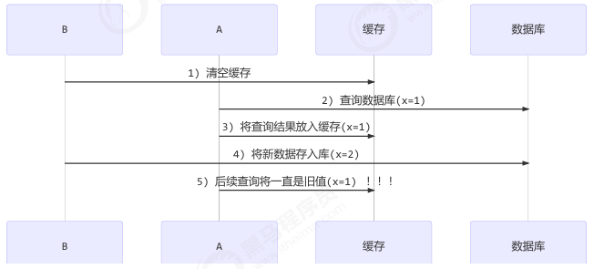
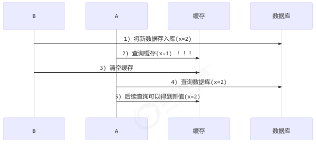
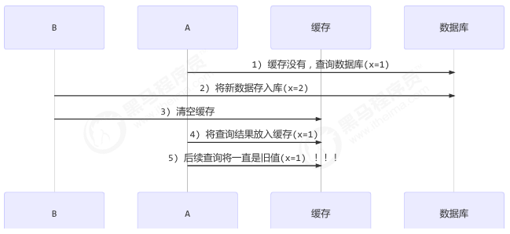

读写锁的应用是数据库缓存一致性

## 不带缓存
见 [GenericDao.java](GenericDao.java)

## 带缓存  更新策略是先清空缓存后更新数据库



## 带缓存  更新策略是先更新数据库后清空缓存（推荐）



## 特殊情况
补充一种情况，假设查询线程 A 查询数据时恰好缓存数据由于时间到期失效，或是第一次查询



这种情况的出现几率非常小，但也是会出现的，见 facebook 论文

## 加锁更进一步保证更新数据库和清空缓存的原子性

```java
package com.lyflexi.synclockpractice.juc.rwlock.rwcache;

import java.util.HashMap;
import java.util.List;
import java.util.Map;
import java.util.concurrent.locks.Lock;
import java.util.concurrent.locks.ReentrantLock;

/**
 * Created with IntelliJ IDEA.
 *
 * @author： hmly
 * @date： 2025/7/5
 * @description： 带缓存功能的DAO
 * @modifiedBy：
 * @version: 1.0
 */
public class GenericDaoCachedV3WithLock extends GenericDao {
    private GenericDao dao = new GenericDao();
    private Map<SqlPair, Object> map = new HashMap<>();
    private Lock lock = new ReentrantLock();

    @Override
    public <T> List<T> queryList(Class<T> beanClass, String sql, Object... args) {
        return dao.queryList(beanClass, sql, args);
    }

    @Override
    public <T> T queryOne(Class<T> beanClass, String sql, Object... args) {
        // 先从缓存中找，找到直接返回
        SqlPair key = new SqlPair(sql, args);;

        T value = (T) map.get(key);
        if(value != null) {
            return value;
        }

        // 缓存中没有，查询数据库
        value = dao.queryOne(beanClass, sql, args);
        map.put(key, value);
        return value;
    }

    @Override
    public int update(String sql, Object... args) {
        lock.lock();
        try {
            //更新数据库
            int update = dao.update(sql, args);
            // 清空缓存
            map.clear();
            return update;
        } finally {
            lock.unlock();
        }

    }
}
```

## 加锁防止系统冷启动的时候大量线程全部涌入DB

```java
package com.lyflexi.synclockpractice.juc.rwlock.rwcache;

import java.util.HashMap;
import java.util.List;
import java.util.Map;
import java.util.concurrent.locks.Lock;
import java.util.concurrent.locks.ReentrantLock;

/**
 * Created with IntelliJ IDEA.
 *
 * @author： hmly
 * @date： 2025/7/5
 * @description： 带缓存功能的DAO
 * @modifiedBy：
 * @version: 1.0
 */
public class GenericDaoCachedV4WithLock extends GenericDao {
    private GenericDao dao = new GenericDao();
    private Map<SqlPair, Object> map = new HashMap<>();
    private Lock lock = new ReentrantLock();

    @Override
    public <T> List<T> queryList(Class<T> beanClass, String sql, Object... args) {
        return dao.queryList(beanClass, sql, args);
    }

    @Override
    public <T> T queryOne(Class<T> beanClass, String sql, Object... args) {
        // 先从缓存中找，找到直接返回
        SqlPair key = new SqlPair(sql, args);;

        T value = (T) map.get(key);
        if(value != null) {
            return value;
        }

        //对写缓存加锁的原因是，防止系统冷启动的时候大量线程全部涌入DB
        lock.lock();
        try {
            value = (T) map.get(key);
            if (value == null) {//DCL
                // 缓存中没有，查询数据库
                value = dao.queryOne(beanClass, sql, args);
                map.put(key, value);
            }
            return value;
        } finally {
            lock.unlock();
        }
    }

    @Override
    public int update(String sql, Object... args) {
        lock.lock();
        try {
            //更新数据库
            int update = dao.update(sql, args);
            // 清空缓存
            map.clear();
            return update;
        } finally {
            lock.unlock();
        }

    }
}

```

## 更加严谨的做法是读写锁，保证读写互斥,读的时候禁止更新

```java
package com.lyflexi.synclockpractice.juc.rwlock.rwcache;

import java.util.HashMap;
import java.util.List;
import java.util.Map;
import java.util.concurrent.locks.Lock;
import java.util.concurrent.locks.ReadWriteLock;
import java.util.concurrent.locks.ReentrantLock;
import java.util.concurrent.locks.ReentrantReadWriteLock;

/**
 * Created with IntelliJ IDEA.
 *
 * @author： hmly
 * @date： 2025/7/5
 * @description： 带缓存功能的DAO
 * @modifiedBy：
 * @version: 1.0
 */
public class GenericDaoCachedV5WithLock extends GenericDao {
    private GenericDao dao = new GenericDao();
    private Map<SqlPair, Object> map = new HashMap<>();
    //更加严谨的做法是读写锁，保证读写互斥
    private ReadWriteLock rw = new ReentrantReadWriteLock();

    @Override
    public <T> List<T> queryList(Class<T> beanClass, String sql, Object... args) {
        return dao.queryList(beanClass, sql, args);
    }

    @Override
    public <T> T queryOne(Class<T> beanClass, String sql, Object... args) {
        // 先从缓存中找，找到直接返回
        SqlPair key = new SqlPair(sql, args);;
        //更加严谨的做法是读写锁，保证读写互斥,读的时候禁止更新
        rw.readLock().lock();
        try {
           T value = (T) map.get(key);
            if(value != null) {
                return value;
            }
        } finally {
            rw.readLock().unlock();
        }

        //对写缓存加锁的原因是，防止系统冷启动的时候大量线程全部涌入DB
        rw.writeLock().lock();
        try {
            T value = (T) map.get(key);
            if (value == null) {//DCL
                // 缓存中没有，查询数据库
                value = dao.queryOne(beanClass, sql, args);
                map.put(key, value);
            }
            return value;
        } finally {
            rw.writeLock().unlock();
        }
    }

    @Override
    public int update(String sql, Object... args) {
        rw.writeLock().lock();
        try {
            //更新数据库
            int update = dao.update(sql, args);
            // 清空缓存
            map.clear();
            return update;
        } finally {
            rw.writeLock().unlock();
        }

    }
}

```

## 总结
读写锁的应用，保证缓存和数据库的一致性，但有下面的问题没有考虑
- 适合读多写少，如果写操作比较频繁，以上实现性能低
- 没有考虑缓存容量
- 没有考虑缓存过期
- 只适合单机
- 并发性还是低，目前只会用一把锁
- 更新方法太过简单粗暴，清空了所有 key（考虑按类型分区或重新设计 key）
- 乐观锁实现：用 CAS 去更新

