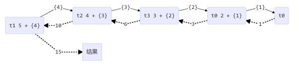
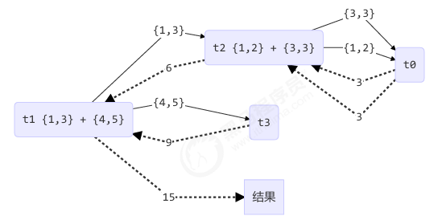

## 递归版ForkJoinAddTask
forkjoin执行过程如下，其中{}表示重写过toString的ForkJoinAddTask

执行结果：
```shell
[ForkJoinPool-1-worker-0] - fork() 2 + {1} 
[ForkJoinPool-1-worker-1] - fork() 5 + {4} 
[ForkJoinPool-1-worker-0] - join() 1 
[ForkJoinPool-1-worker-0] - join() 2 + {1} = 3 
[ForkJoinPool-1-worker-2] - fork() 4 + {3} 
[ForkJoinPool-1-worker-3] - fork() 3 + {2} 
[ForkJoinPool-1-worker-3] - join() 3 + {2} = 6 
[ForkJoinPool-1-worker-2] - join() 4 + {3} = 10 
[ForkJoinPool-1-worker-1] - join() 5 + {4} = 15 
15 
```
执行图示



## 分治+递归版ForkJoinAddTaskOptimize

forkjoin执行过程如下，其中{}表示重写过toString的ForkJoinAddTaskOptimize

```shell
[ForkJoinPool-1-worker-0] - join() 1 + 2 = 3 
[ForkJoinPool-1-worker-3] - join() 4 + 5 = 9 
[ForkJoinPool-1-worker-0] - join() 3 
[ForkJoinPool-1-worker-1] - fork() {1,3} + {4,5} = ? 
[ForkJoinPool-1-worker-2] - fork() {1,2} + {3,3} = ? 
[ForkJoinPool-1-worker-2] - join() {1,2} + {3,3} = 6 
[ForkJoinPool-1-worker-1] - join() {1,3} + {4,5} = 15 
15 
```
执行图示



