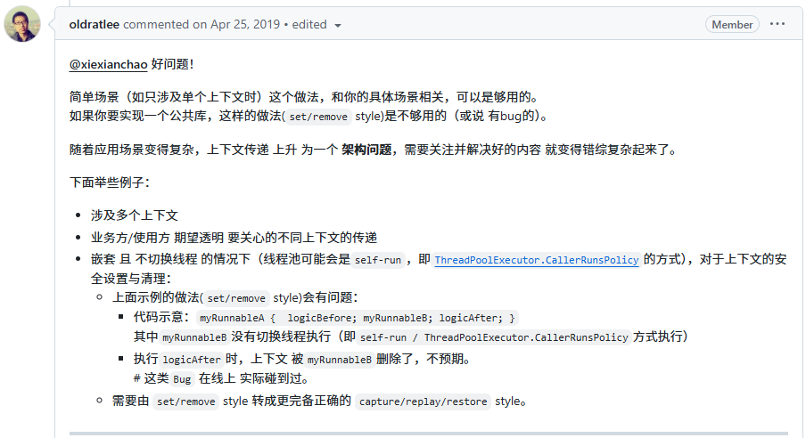

先不看ttl源码，直接上来就搞代码轰炸没人能看得懂。所以我们先自己推一推要如何实现这个功能。

我们先想一想，父线程和线程池中的线程交互的时间点并不多。但是有一个时间点大家一定都知道：提交任务的时候。

当我们想要给线程池提供一个任务的时候，就需要在父线程中先构建好任务类（Runnable 和Callable）。我们完全可以在构造子任务的时候，尝试把父线程的本地缓存传递给子线程。

没错，这其实就是TransmittableThreadLocal一部分的设计原理，在构造子任务而不是构造线程的时候，尝试把父线程的本地缓存传递给子线程。

但是上述思路也只是ttl设计思想的一部分，为什么只是一部分呢？https://github.com/alibaba/transmittable-thread-local/issues/135

issue：

answer：

我也是看了好几天才理解了作者的意思，所以我在这里解释一下为什么不能仅仅使用修饰Runnable或者Callbable：

1. 单一上下文传递：提到的代理Runnable方式适用于只传递一个上下文的场景。如果需要传递多个上下文，这种方式就需要为每个上下文创建一个代理类，这会导致代码复杂度增加。
2. 嵌套执行问题：在没有线程切换的情况下（例如，使用ThreadPoolExecutor.CallerRunsPolicy），上下文的设置和清理会变得复杂。如果一个Runnable在执行另一个Runnable之前没有正确清理上下文，那么后续的逻辑可能会使用错误的上下文。

>CallerRunsPolicy是一种线程池策略，CallerRunsPolicy 策略既不会抛弃任务，也不会抛出异常，而是将任务回退到调用者线程（即提交任务的线程）中执行。如果执行程序已关闭，则会丢弃该任务]

因此作者在TransmittableThreadLocal设计出了以下三种方法：

1. Capture（捕获）：在上下文需要被传递之前，捕获当前线程的上下文信息。 
2. Replay（重放）：在目标线程中重放捕获的上下文信息，确保目标线程能够访问到正确的上下文。 
3. Restore（恢复）：在上下文被传递之后，恢复原始线程的上下文，以避免对其他任务产生影响。

严格对应于ttl源码的这三个方法的分析如下：

TODO

